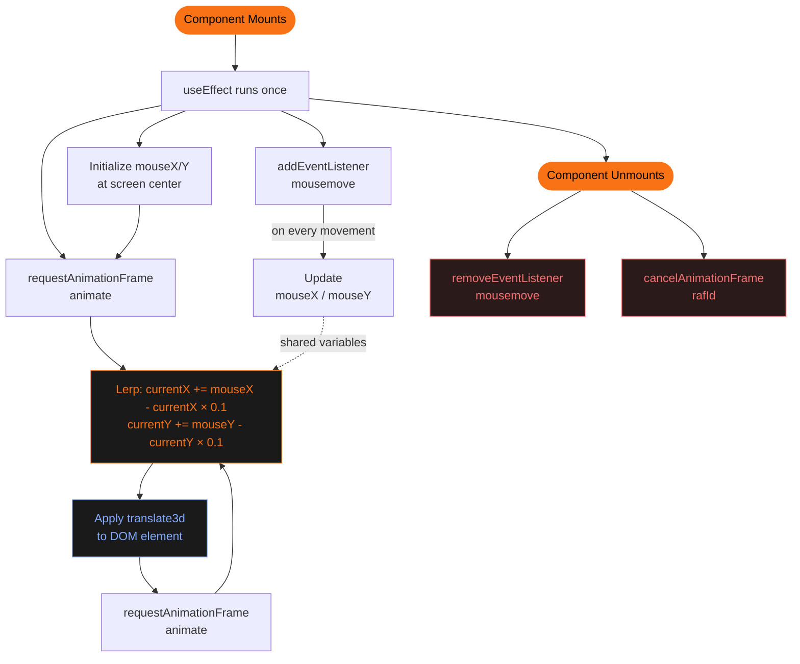

import { ArticleLayout } from '@/components/ArticleLayout'

export const article = {
    author: 'Lenildo Luan',
    date: '2026-03-01',
    title: 'Mouse Follower 60fps',
    description:
        'I always thought it was really cool when I visited a creative website and saw that little ball following the mouse with a smooth, fluid movement. It looks simple, but behind it there is a pretty interesting technical implementation. In this article, we will analyze a code where I implemented a Mouse Follower on my website using React/Next.js and Tailwind CSS, and understand how it works step by step.',
}

export const metadata = {
    title: article.title,
    description: article.description,
}

export default (props) => <ArticleLayout article={article} {...props} />

I always thought it was really cool when I visited a creative website and saw that little ball following the mouse with a smooth, fluid movement. It looks simple, but behind it there is a pretty interesting technical implementation. In this article, we will analyze a code where I implemented a Mouse Follower on my website using React/Next.js and Tailwind CSS, and understand how it works step by step.

---

## What is a Mouse Follower?

A Mouse Follower is an HTML element that tracks the user's cursor, but with a small intentional delay. That delay creates a sense of **inertia**. The result is a fluid animation that enhances the visual experience without hurting usability.

---

## The element structure in JSX

```tsx
<div
  ref={followerRef}
  id="follower"
  className="mix-blend-difference hidden md:block fixed w-4 h-4 bg-orange-500 dark:bg-orange-400 rounded-full pointer-events-none -translate-x-1/2 -translate-y-1/2 z-[1000]"
/>
```

Each class has a specific role:

| Class | Purpose |
|---|---|
| `fixed` | Keeps the element relative to the viewport, not the scroll |
| `w-4 h-4` | Size of 16×16px |
| `rounded-full` | Turns the div into a perfect circle |
| `pointer-events-none` | The follower does not intercept clicks or mouse events |
| `-translate-x-1/2 -translate-y-1/2` | Centers the circle exactly on the cursor point |
| `mix-blend-difference` | Blend mode that inverts the background color beneath the element |
| `hidden md:block` | Disables the follower on screens smaller than `md` (768px) — on mobile there is no cursor |
| `z-[1000]` | Ensures the follower stays above all content |

> Without `pointer-events-none`, the follower itself would block mouse events, preventing clicks on elements below it.

---

## `useRef` as a bridge to the DOM

```tsx
const followerRef = useRef<HTMLDivElement | null>(null)
```

`useRef` creates a mutable reference that points directly to a DOM element, making it possible to manipulate it in React without triggering re-renders. By attaching `ref={followerRef}` to the `<div>`, we get direct access to the HTML node inside `useEffect`.

---

## The heart of the animation: `useEffect`

All the follower behavior lives inside a single `useEffect` with an empty dependency array (`[]`), meaning it runs **only once**, right after the component mounts.

```tsx
useEffect(() => {
  const follower = followerRef.current
  if (!follower) return

  let mouseX = window.innerWidth / 2
  let mouseY = window.innerHeight / 2
  let currentX = mouseX
  let currentY = mouseY

  const easeAmount = 0.1
  let rafId: number

  // ...

  return () => {
    document.removeEventListener('mousemove', handleMouseMove)
    cancelAnimationFrame(rafId)
  }
}, [])
```

### Variable initialization

The position variables are initialized at the center of the screen (`window.innerWidth / 2`, `window.innerHeight / 2`). This prevents the circle from appearing at corner `(0, 0)` before the first mouse movement.

Two distinct positions are created:

- `mouseX / mouseY` — the real, instantaneous position of the cursor
- `currentX / currentY` — the follower's current position, which smoothly approaches the cursor

---

## Capturing the mouse with `mousemove`

```tsx
const handleMouseMove = (e: MouseEvent) => {
  mouseX = e.clientX
  mouseY = e.clientY
}

document.addEventListener('mousemove', handleMouseMove, {
  passive: true,
})
```

The listener is added to `document` (not to a specific element) to capture the cursor anywhere on the page.

The `{ passive: true }` option is a performance optimization: it tells the browser that the handler **will never call `preventDefault()`**, freeing the main thread to process scrolling without waiting for the handler.

> Notice that `mouseX`, `mouseY`, `currentX` and `currentY` are plain `let` variables — not `useState`. This is intentional. Updating React state on every mouse move would cause many re-renders per second, destroying performance.

---

## Animating with linear easing

```tsx
const animate = () => {
  currentX += (mouseX - currentX) * easeAmount
  currentY += (mouseY - currentY) * easeAmount

  follower.style.transform = `translate3d(${currentX}px, ${currentY}px, 0)`

  rafId = requestAnimationFrame(animate)
}
```

This is the most elegant part of the code. The formula:

```
currentX += (mouseX - currentX) * 0.1
```

Is a **linear interpolator** (lerp). On every frame, the follower travels **10% of the remaining distance** to the cursor. This creates a movement that:

- Is **fast at the start** (when the distance is large)
- **Decelerates smoothly** as it approaches the destination
- **Never fully stops** (mathematically, there is always a fraction of distance remaining), which gives a continuous sense of lightness

With `easeAmount = 0.1`, the effect is quite noticeable. Smaller values (e.g. `0.05`) create more inertia; larger values (e.g. `0.3`) make the follower faster.

### Why `translate3d` instead of `left/top`?

```tsx
follower.style.transform = `translate3d(${currentX}px, ${currentY}px, 0)`
```

Manipulating `left` and `top` forces the browser to recalculate the layout (**reflow**), which is costly. `transform: translate3d(...)` operates exclusively on the **GPU compositing layer**, without affecting the layout — bringing the animation closer to the coveted 60 frames per second.

The `0` on the Z axis (`translate3d(x, y, 0)`) is intentional: it forces the browser to create a **dedicated compositing layer** for the element, further optimizing rendering.

---

## `requestAnimationFrame`: animation synchronized with the display

```tsx
const animate = () => {
  // ...updates position...
  rafId = requestAnimationFrame(animate)
}

rafId = requestAnimationFrame(animate)
```

`requestAnimationFrame` (rAF) schedules the execution of the `animate` function for the browser's next paint frame — typically **60 times per second** on standard displays, or 120fps on high-refresh-rate monitors.

Compared to `setInterval`, rAF has important advantages:

- **Pauses automatically** when the tab is in the background, saving resources
- **Synchronizes with the browser's rendering cycle**, avoiding visual tearing
- **Does not accumulate delayed executions** the way `setInterval` can

The returned ID (`rafId`) is stored so the loop can be cancelled in the cleanup.

---

## Resource cleanup

```tsx
return () => {
  document.removeEventListener('mousemove', handleMouseMove)
  cancelAnimationFrame(rafId)
}
```

The return function of `useEffect` is the **cleanup** — executed when the component unmounts. Here we do two crucial things:

1. **Remove the event listener** to avoid memory leaks
2. **Cancel the rAF** to stop the animation loop

Without this, the listener and the loop would keep running even after the component is unmounted.

---

## The complete flow visualized



---

## Implemented best practices

**Separation of concerns between reading and rendering.** The `mousemove` handler only reads and stores the position. `requestAnimationFrame` is the sole responsible for updating the DOM. This is the correct pattern: never manipulate the DOM directly inside high-frequency event listeners.

**No React state for animation data.** All the logic uses plain JavaScript variables. `useState` would be an anti-pattern here — it would cause unnecessary re-renders and could break the animation.

**Native responsiveness.** The `hidden md:block` class disables the follower on mobile without any additional JavaScript, using only Tailwind CSS.

**`mix-blend-mode: difference`.** A sophisticated UX detail: the follower automatically contrasts against any background, whether light or dark, without needing theme logic.

---

## Variations and customizations

You can easily adjust the behavior by tweaking a few values:

```tsx
// "Heavier" follower (more inertia)
const easeAmount = 0.05

// Instant follower (no easing)
const easeAmount = 1

// Scale up on click (extension example)
document.addEventListener('mousedown', () => {
  follower.style.transform += ' scale(1.5)'
})
```

For an even more sophisticated effect, it is common to have **two elements** — a smaller one that follows the cursor with low easing and a larger one (the "trail") with even lower easing, creating a tail effect.

---

## Conclusion

The Mouse Follower in this code is an example of **high-performance browser animation**. It combines three fundamental front-end development concepts:

- **Lerp (Linear Interpolation)** to create smoothness without external libraries
- **`requestAnimationFrame`** for animations synchronized with the display
- **`transform: translate3d`** to move elements on the GPU without triggering reflow

The result is a polished visual effect with minimal performance cost — exactly the balance we strive for in our web animations.